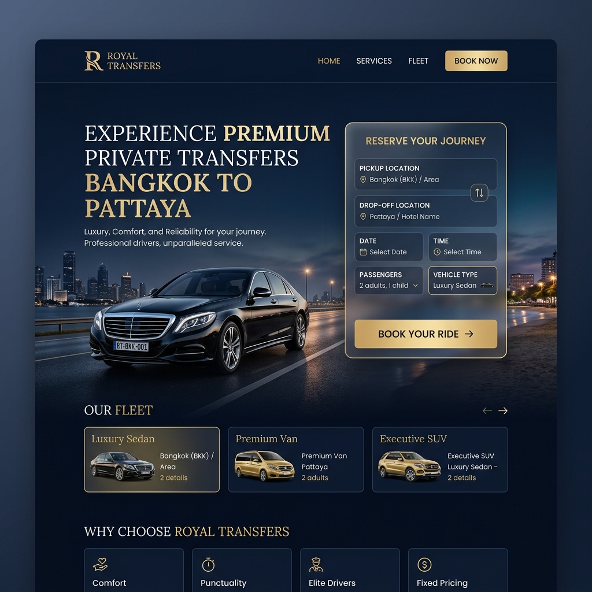
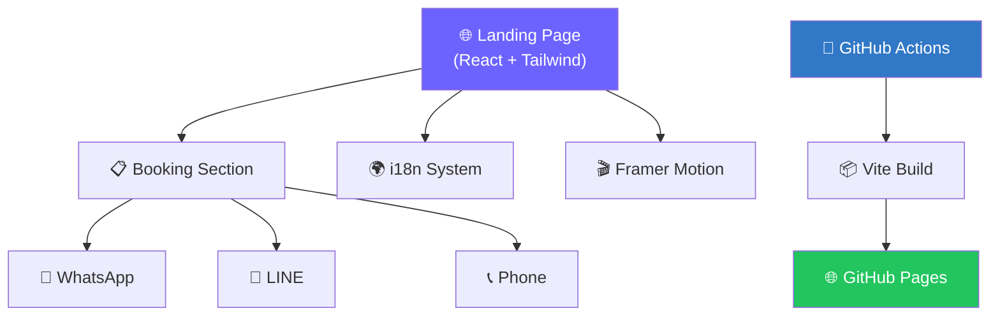

# 🚕 BKK Pattaya Private Taxi

> High-conversion SEO landing page for a private taxi service in Thailand.
>
> 🌐 **Live Site:** [romeototo.github.io/bkk-pattaya-taxi](https://romeototo.github.io/bkk-pattaya-taxi/)
>
> 🇹🇭 [อ่านเป็นภาษาไทย (Thai Version)](./README.th.md)

<div align="center">


</div>

---

## Project Snapshot

| Item | Details |
| ---- | ------- |
| **Role** | SEO landing page and booking flow for a Thailand private taxi service |
| **Live demo** | [romeototo.github.io/bkk-pattaya-taxi](https://romeototo.github.io/bkk-pattaya-taxi/) |
| **Stack** | React 19, TypeScript, Tailwind CSS 4, Vite, Framer Motion |
| **Impact** | Route-focused booking funnel with multi-language support and multi-channel contact paths |
| **Status** | Active public web product |
| **Portfolio case study** | [BKK Pattaya Private Taxi](https://romeototo.github.io/portfolio-website/case-studies/bkk-pattaya-taxi/) |

---

## 📸 Screenshots

| Hero Section |
| :---: |
|  |

---

## ✨ Features

| Category | Details |
|----------|---------|
| 🎨 **Premium VIP Theme** | Midnight Blue & Champagne Gold design for luxury feel |
| 📋 **Booking Form** | Multi-step booking flow with route selection and passenger details |
| 🌐 **Multi-Language** | Thai, English, Chinese, and Russian support (i18n) |
| 💬 **Multi-Channel Contact** | WhatsApp, LINE, and phone call integration |
| 🎬 **Smooth Animations** | Framer Motion entrance animations and micro-interactions |
| 📱 **Fully Responsive** | Mobile-first design optimized for all screen sizes |
| 🔍 **SEO Optimized** | Meta tags, Open Graph, semantic HTML structure |
| ⚡ **Lightning Fast** | Static deployment on GitHub Pages with Vite build optimization |

---

## 🏗️ Architecture



> **Note:** This is a frontend-only application. Booking inquiries are routed directly to WhatsApp/LINE/Phone — no backend server required.

---

## 🛠️ Tech Stack

| Layer | Technology |
|-------|-----------|
| **UI Framework** | React 19 + TypeScript |
| **Styling** | Tailwind CSS 4 + Radix UI primitives |
| **Animations** | Framer Motion |
| **Icons** | Lucide React |
| **Build Tool** | Vite 7 |
| **Deployment** | GitHub Actions → GitHub Pages |
| **Testing** | Vitest |

---

## 🚀 Quick Start

```bash
# Clone the repository
git clone https://github.com/romeototo/bkk-pattaya-taxi.git
cd bkk-pattaya-taxi

# Install dependencies
pnpm install

# Start development server
pnpm dev
```

The app will be available at `http://localhost:5173`

### Build for Production

```bash
pnpm build
pnpm preview
```

---

## 📁 Project Structure

```
bkk-pattaya-taxi/
├── client/
│   ├── index.html          # Entry HTML
│   ├── public/             # Static assets (images, favicon)
│   └── src/
│       ├── App.tsx          # Root component with routing
│       ├── main.tsx         # React entry point
│       ├── index.css        # Global styles + Tailwind
│       ├── sections/        # Page sections (Hero, Booking, FAQ, etc.)
│       ├── components/      # Reusable UI components (Radix-based)
│       ├── config/          # Route pricing & app configuration
│       ├── contexts/        # React context providers
│       ├── hooks/           # Custom React hooks
│       ├── i18n/            # Multi-language translations (TH/EN/CN/RU)
│       ├── lib/             # Utility functions
│       └── pages/           # Route pages
├── .github/workflows/
│   └── deploy.yml          # GitHub Actions CI/CD pipeline
├── vite.config.ts          # Vite configuration
├── tsconfig.json           # TypeScript configuration
└── package.json            # Dependencies & scripts
```

---

## 🌐 Deployment

The site is automatically deployed to **GitHub Pages** via GitHub Actions on every push to `main`.

The CI/CD pipeline:
1. Checks out the code
2. Installs dependencies with `pnpm`
3. Builds the production bundle with `vite build`
4. Deploys the `dist/public` folder to GitHub Pages

---

## 📄 License

[MIT](./LICENSE) © Romeo T.

---

<div align="center">
  <b>Developed by <a href="https://github.com/romeototo">romeototo</a></b><br>
  <i>Automate · Control · Innovate</i><br>
  <a href="https://romeototo.github.io/portfolio-website/">View My Portfolio</a>
</div>
