# 🚕 BKK Pattaya Private Taxi

> High-conversion SEO landing page & booking system for a private taxi service in Thailand.
>
> 🌐 **Live Demo:** [romeototo.github.io/bkk-pattaya-taxi](https://romeototo.github.io/bkk-pattaya-taxi/)


---

## ✨ Features

| Category | Details |
|----------|---------|
| 🎨 **Landing Page** | SEO-optimized, mobile-responsive with Framer Motion animations |
| 📋 **Booking Form** | Multi-step form with Zod validation & react-hook-form |
| 🔔 **Multi-Channel Notifications** | Google Sheets + Telegram + LINE + Email (SMTP) |
| 🛡️ **Admin Dashboard** | Booking management, analytics, authentication |
| 📊 **Analytics** | Recharts-based dashboards with booking stats |
| 🌐 **SEO** | Meta tags, Open Graph, structured data |

---

## 🏗️ Architecture

```mermaid
graph TD
    A["🌐 Landing Page<br/>(React + Tailwind)"] --> B["📋 Booking Form"]
    B --> C["🔀 tRPC Router<br/>(Express Backend)"]
    C --> D["💾 MySQL/TiDB<br/>(Drizzle ORM)"]
    C --> E["📢 Notification Service"]
    
    E --> F["📊 Google Sheets"]
    E --> G["🤖 Telegram Bot"]
    E --> H["💬 LINE Messaging"]
    E --> I["📧 Email SMTP"]
    
    J["🔐 Admin Dashboard"] --> C
    J --> K["📈 Analytics<br/>(Recharts)"]

    style A fill:#6C63FF,color:#fff
    style C fill:#3178C6,color:#fff
    style D fill:#4479A1,color:#fff
    style E fill:#FF6B35,color:#fff
```



---

## 🛠️ Tech Stack

### Frontend
- **React 19** + TypeScript — Modern UI with hooks
- **Tailwind CSS 4** — Utility-first styling
- **Radix UI** — Accessible component primitives
- **Framer Motion** — Smooth animations
- **React Hook Form** + Zod — Type-safe form validation

### Backend
- **Express** + TypeScript — API server
- **tRPC** — End-to-end type-safe API
- **Drizzle ORM** — Type-safe database queries
- **MySQL/TiDB** — Relational database

### Integrations
- **Google Sheets API** — Booking spreadsheet sync
- **Telegram Bot API** — Instant booking notifications
- **LINE Messaging API** — Customer communication
- **Nodemailer** — Email confirmations & admin alerts

---

## 🚀 Quick Start

```bash
# Clone the repository
git clone https://github.com/romeototo/bkk-pattaya-taxi.git
cd bkk-pattaya-taxi

# Install dependencies
pnpm install

# Configure environment values
copy .env.example .env

# Set up database and create the first admin
pnpm db:push
pnpm admin:create -- --username admin --email owner@example.com --password "change-this-password"

# Start development server
pnpm dev
```

The app will be available at `http://localhost:3000`

For Telegram booking alerts, set `TELEGRAM_BOT_TOKEN` and `TELEGRAM_CHAT_ID` in `.env`. The backend must be running for form submissions to reach Telegram; GitHub Pages alone only serves the static frontend.

See [SETUP_GUIDE.md](./SETUP_GUIDE.md) for detailed configuration of all notification channels.

---

## 📁 Project Structure

```
bkk-pattaya-taxi/
├── client/              # React frontend
│   ├── components/      # UI components (Radix + Tailwind)
│   ├── pages/           # Route pages
│   └── hooks/           # Custom React hooks
├── server/              # Express backend
│   ├── _core/           # Server setup & middleware
│   ├── routers/         # tRPC routers
│   └── integrations/    # Google Sheets, Telegram, LINE, Email
├── shared/              # Shared types & schemas (Zod)
├── drizzle/             # Database migrations
└── SETUP_GUIDE.md       # Full deployment guide
```

---

## 📚 Documentation

- [**Setup Guide**](./SETUP_GUIDE.md) — Full installation & configuration
- [**Notification Architecture**](./NOTIFICATION_ARCHITECTURE.md) — Multi-channel notification system design

---

## 📄 License

[MIT](./LICENSE) © Romeo T.
