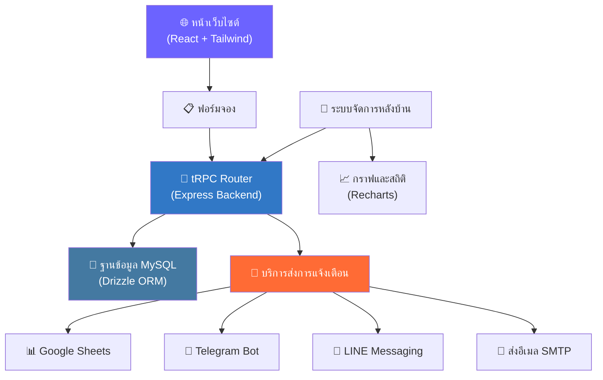

# 🚕 BKK Pattaya Private Taxi

> เว็บไซต์ Landing Page และระบบจองรถแท็กซี่ส่วนตัว (Private Transfer) ระหว่างกรุงเทพฯ และพัทยา ที่เน้นทำ SEO และมุ่งเน้นเพิ่มยอด Conversion
>
> 🌐 **เว็บไซต์จริง (Live Demo):** [romeototo.github.io/bkk-pattaya-taxi](https://romeototo.github.io/bkk-pattaya-taxi/)
>
> 🇹🇭 [อ่านเป็นภาษาอังกฤษ (English Version)](./README.md)


---

## 📸 Screenshots & UI Design
เว็บไซต์ถูกออกแบบมาในธีม **VIP Midnight Blue & Champagne Gold** เพื่อเสริมสร้างภาพลักษณ์ความน่าเชื่อถือ หรูหรา และเป็นมืออาชีพ

| Hero Section (หน้าแรก) | Booking Wizard (ฟอร์มการจอง) |
| :---: | :---: |
|  |  |

| Why Choose Us (Bento Grid Layout) |
| :---: |
|  |

*(หมายเหตุ: ใส่ภาพ Screenshot ของจริงทับลิงก์ placehold.co ในอนาคต)*

---

## ✨ ฟีเจอร์เด่น (Features)

| หมวดหมู่ | รายละเอียด |
|----------|---------|
| 🎨 **Landing Page** | ออกแบบให้โหลดเร็ว รองรับ SEO และแสดงผลได้ดีบนมือถือ พร้อม Animation ด้วย Framer Motion |
| 📋 **Booking Form** | ฟอร์มจองแบบหลายขั้นตอน (Wizard) พร้อมการตรวจเช็คข้อมูลด้วย Zod และ React Hook Form |
| 🔔 **ระบบแจ้งเตือน** | ยิงข้อมูลเข้า Google Sheets + Telegram + LINE + อีเมล (SMTP) อัตโนมัติ |
| 🛡️ **ระบบหลังบ้าน** | แดชบอร์ดจัดการข้อมูลการจอง ดูสถิติ และระบบล็อกอินแอดมิน |
| 📊 **Analytics** | กราฟสรุปสถิติการใช้งานด้วย Recharts |
| 🌐 **SEO & 2 ภาษา** | รองรับภาษาไทย/อังกฤษ (EN/TH) พร้อมระบบ Meta tags และ Open Graph |

---

## 🏗️ โครงสร้างสถาปัตยกรรม (Architecture)



---

## 🛠️ เทคโนโลยีที่ใช้ (Tech Stack)

### หน้าบ้าน (Frontend)
- **React 19** + TypeScript
- **Tailwind CSS 4** — ตกแต่งเว็บไซต์อย่างรวดเร็ว
- **Radix UI** — Component ยืดหยุ่นและเข้าถึงได้ง่าย (Accessible)
- **Framer Motion** — จัดการ Animation ต่างๆ บนเว็บ
- **React Hook Form** + Zod — ตรวจจับข้อผิดพลาดในฟอร์มอย่างแม่นยำ

### หลังบ้าน (Backend)
- **Express** + TypeScript
- **tRPC** — เชื่อมต่อ API แบบ Type-safe ป้องกันข้อผิดพลาด
- **Drizzle ORM** — จัดการฐานข้อมูลอย่างมีประสิทธิภาพ
- **MySQL/TiDB** — ฐานข้อมูลแบบ Relation

### การเชื่อมต่อกับบริการภายนอก (Integrations)
- **Google Sheets API** — บันทึกข้อมูลคนจองลงตารางอัตโนมัติ
- **Telegram Bot API** — ส่งแจ้งเตือนการจองให้คนขับผ่านกลุ่ม
- **LINE Messaging API** — เชื่อมโยงลูกค้า
- **Nodemailer** — จัดการระบบอีเมลตอบกลับ

---

## 🚀 เริ่มต้นใช้งานโปรเจกต์ (Quick Start)

ดูรายละเอียดการตั้งค่าแบบเจาะลึกได้ที่ [คู่มือการติดตั้ง (SETUP_GUIDE.md)](./SETUP_GUIDE.md)

```bash
# คัดลอกโปรเจกต์
git clone https://github.com/romeototo/bkk-pattaya-taxi.git
cd bkk-pattaya-taxi

# ติดตั้งไลบรารี
pnpm install

# ตั้งค่า Environment Variables
copy .env.example .env

# สร้างฐานข้อมูลและแอดมินคนแรก
pnpm db:push
pnpm admin:create -- --username admin --email owner@example.com --password "เปลี่ยนรหัสผ่านที่นี่"

# เปิดเซิร์ฟเวอร์สำหรับพัฒนา
pnpm dev
```

---

## 📄 ลิขสิทธิ์ (License)

[MIT](./LICENSE) © Romeo T.
