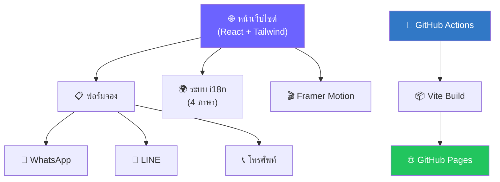

# 🚕 BKK Pattaya Private Taxi

> เว็บไซต์ Landing Page สำหรับบริการรถแท็กซี่ส่วนตัว (Private Transfer) ระหว่างกรุงเทพฯ และพัทยา ที่เน้นทำ SEO และมุ่งเน้นเพิ่มยอด Conversion
>
> 🌐 **เว็บไซต์จริง (Live Site):** [romeototo.github.io/bkk-pattaya-taxi](https://romeototo.github.io/bkk-pattaya-taxi/)
>
> 🇬🇧 [อ่านเป็นภาษาอังกฤษ (English Version)](./README.md)

<div align="center">


</div>

---

## Project Snapshot

| รายการ | รายละเอียด |
| ------ | ----------- |
| **บทบาท** | SEO landing page สำหรับบริการรถส่วนตัวในไทย |
| **Live demo** | [romeototo.github.io/bkk-pattaya-taxi](https://romeototo.github.io/bkk-pattaya-taxi/) |
| **Stack** | React 19, TypeScript, Tailwind CSS 4, Vite, Framer Motion |
| **Impact** | Route-focused booking funnel พร้อมรองรับ 4 ภาษา และหลายช่องทางติดต่อ |
| **สถานะ** | Active public web product |
| **Portfolio case study** | [BKK Pattaya Private Taxi](https://romeototo.github.io/portfolio-website/case-studies/bkk-pattaya-taxi/) |

---

## 📸 Screenshots

| Hero Section (หน้าแรก) |
| :---: |
|  |

---

## ✨ ฟีเจอร์เด่น (Features)

| หมวดหมู่ | รายละเอียด |
|----------|---------|
| 🎨 **ธีม VIP สุดหรู** | สี Midnight Blue & Champagne Gold สร้างความน่าเชื่อถือ |
| 📋 **ฟอร์มจองรถ** | เลือกเส้นทาง จำนวนผู้โดยสาร และรายละเอียดการเดินทาง |
| 🌐 **รองรับ 4 ภาษา** | ไทย, อังกฤษ, จีน, รัสเซีย (i18n) |
| 💬 **ติดต่อหลายช่องทาง** | WhatsApp, LINE, โทรศัพท์ |
| 🎬 **Animation สุดสมูท** | Framer Motion สร้างความลื่นไหลในทุกการเลื่อน |
| 📱 **Responsive** | ออกแบบ Mobile-first รองรับทุกหน้าจอ |
| 🔍 **SEO** | Meta tags, Open Graph, Semantic HTML |
| ⚡ **โหลดเร็วมาก** | Static deployment บน GitHub Pages |

---

## 🏗️ โครงสร้างสถาปัตยกรรม (Architecture)



> **หมายเหตุ:** เว็บไซต์นี้เป็น Frontend-only — การจองจะถูกส่งไปยัง WhatsApp/LINE/โทรศัพท์โดยตรง ไม่จำเป็นต้องมี Backend

---

## 🛠️ เทคโนโลยีที่ใช้ (Tech Stack)

| ส่วน | เทคโนโลยี |
|------|-----------|
| **UI Framework** | React 19 + TypeScript |
| **สไตล์** | Tailwind CSS 4 + Radix UI |
| **Animation** | Framer Motion |
| **Icons** | Lucide React |
| **Build Tool** | Vite 7 |
| **Deployment** | GitHub Actions → GitHub Pages |
| **Testing** | Vitest |

---

## 🚀 เริ่มต้นใช้งานโปรเจกต์ (Quick Start)

```bash
# คัดลอกโปรเจกต์
git clone https://github.com/romeototo/bkk-pattaya-taxi.git
cd bkk-pattaya-taxi

# ติดตั้งไลบรารี
pnpm install

# เปิดเซิร์ฟเวอร์สำหรับพัฒนา
pnpm dev
```

เปิดเบราว์เซอร์ไปที่ `http://localhost:5173`

### Build สำหรับ Production

```bash
pnpm build
pnpm preview
```

---

## 📁 โครงสร้างโปรเจกต์

```
bkk-pattaya-taxi/
├── client/
│   ├── index.html          # HTML หลัก
│   ├── public/             # ไฟล์ static (รูปภาพ, favicon)
│   └── src/
│       ├── App.tsx          # Root component
│       ├── main.tsx         # จุดเริ่มต้น React
│       ├── index.css        # Global styles + Tailwind
│       ├── sections/        # ส่วนต่างๆ ของหน้าเว็บ (Hero, Booking, FAQ ฯลฯ)
│       ├── components/      # UI components (Radix-based)
│       ├── config/          # ราคาเส้นทาง & การตั้งค่า
│       ├── contexts/        # React context providers
│       ├── hooks/           # Custom React hooks
│       ├── i18n/            # ไฟล์แปลภาษา (TH/EN/CN/RU)
│       ├── lib/             # Utility functions
│       └── pages/           # Route pages
├── .github/workflows/
│   └── deploy.yml          # GitHub Actions CI/CD
├── vite.config.ts          # Vite config
├── tsconfig.json           # TypeScript config
└── package.json            # Dependencies & scripts
```

---

## 📄 ลิขสิทธิ์ (License)

[MIT](./LICENSE) © Romeo T.

---

<div align="center">
  <b>พัฒนาโดย <a href="https://github.com/romeototo">romeototo</a></b><br>
  <i>Automate · Control · Innovate</i><br>
  <a href="https://romeototo.github.io/portfolio-website/">ดู Portfolio ของฉัน</a>
</div>
